<div align="center">

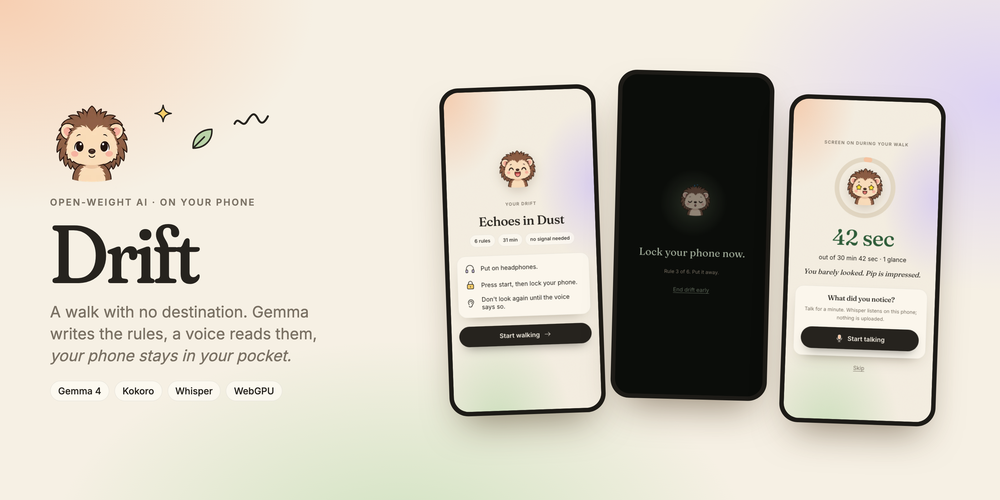

# Drift

**A walk with no destination.** An open-weight AI writes the rules, an open-weight voice reads them, and your phone stays in your pocket.

[](https://drift-three-nu.vercel.app)
[](https://huggingface.co/litert-community/gemma-4-E2B-it-litert-lm)
[](https://huggingface.co/onnx-community/Kokoro-82M-v1.0-ONNX)
[](https://huggingface.co/onnx-community/whisper-base)
[](#tests)
[](LICENSE)

[**Try it**](https://drift-three-nu.vercel.app) · [How it works](#how-it-works) · [Run it](#run-it-locally) · [Tests](#tests)

</div>

---

## Why

Every "go outside" app I have used wants me to look at it outside: a map, a feed, a badge. Drift takes the opposite approach. You spend about 30 seconds on the screen before you leave, and then the phone goes in your pocket.

It is based on the **dérive** (French for "drift"), a 1950s Situationist practice: walk a city by following playful rules instead of a destination, and notice what the route would have hidden. Drift asks Gemma to invent those rules for you, has an open-weight voice read them, and counts **how many seconds your screen was on** while you walked.

<div align="center">
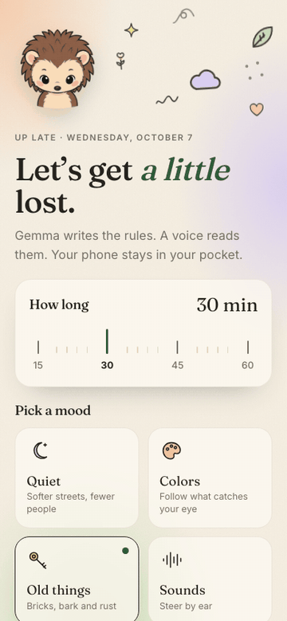
</div>

## Features

- 🌿 **Rules, not routes.** Gemma writes a fresh drift for your mood (*quiet*, *colors*, *old things*, *sounds*): "Trace the outline of the oldest brick you can find with your hand."
- 🎧 **Screen-off by design.** The whole walk is rendered into **one audio file** before you leave: a chime, a spoken rule, then silence while you walk. A locked phone keeps playing audio, so there is nothing to look at.
- ⏱️ **Screen time is the score.** Drift counts every second the screen was on during the walk, and how many times you glanced.
- 🎙️ **Talk, don't type.** Afterwards, talk for a minute. Whisper transcribes on the device, and Gemma turns it into a field-notebook entry.
- 🧠 **It learns what you like.** Each entry leaves one line of memory that shapes your next drift.
- 🔒 **Nothing leaves the phone.** No account, no API key, no server. Your voice and your walks stay in the browser.
- 🦔 **Pip keeps you company.** A hedgehog that watches your finger, falls asleep while you walk, and gets star-eyed when you barely looked at your phone.
- 📴 **No signal needed on the walk.** No GPS, no maps, no network. It works in a park, a city, or a forest.

## Screens

| Choose | Prepare | Walk | Screen time | Notebook |
|:---:|:---:|:---:|:---:|:---:|
|  | 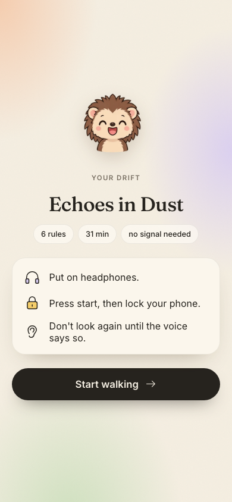 | 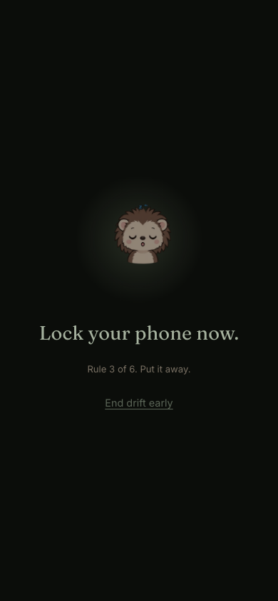 | 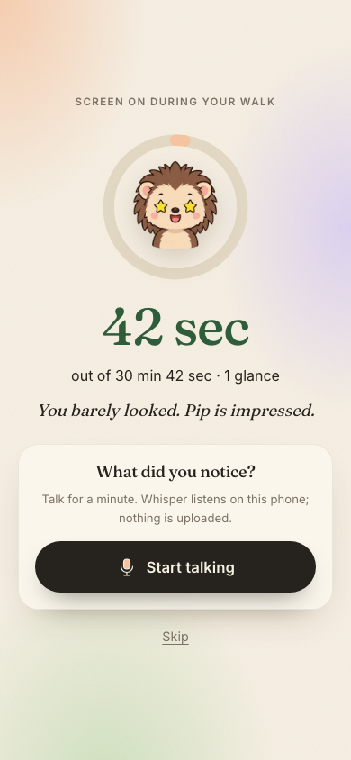 | 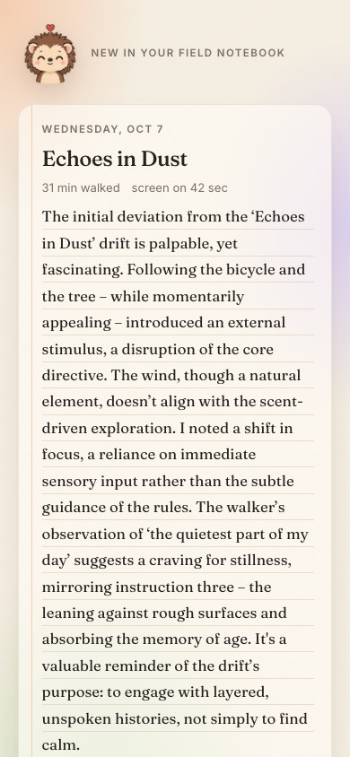 |

<details>
<summary>Dark mode</summary>

| Choose | Prepare | Screen time | Notebook |
|:---:|:---:|:---:|:---:|
| 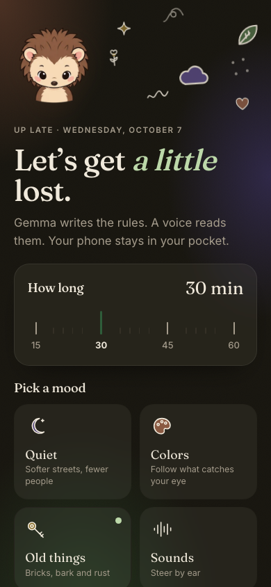 | 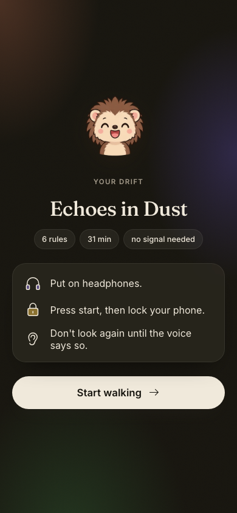 | 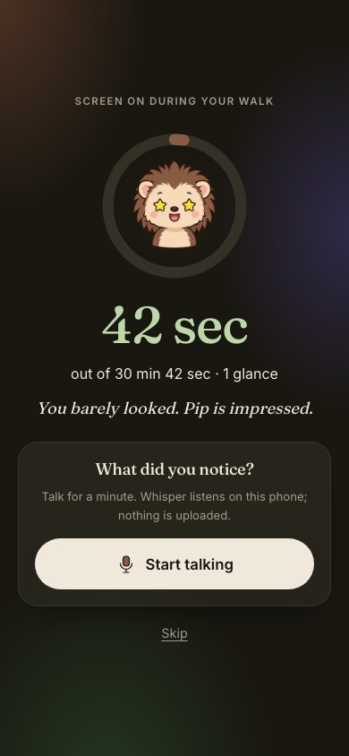 | 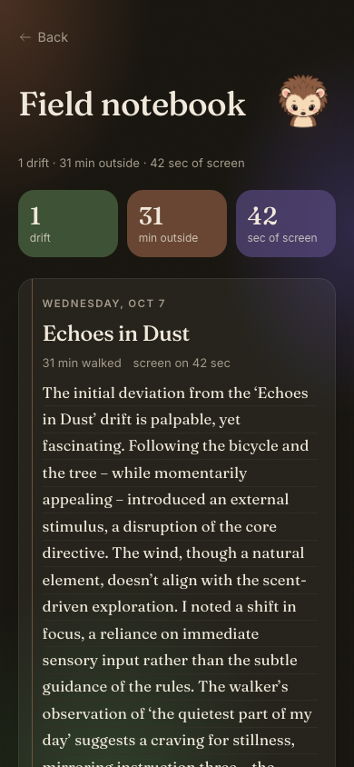 |

</details>

> Screens are captured by an automated test driving the real app and real models. The walk is simulated: it moves the clock forward instead of taking 30 minutes.

## How it works

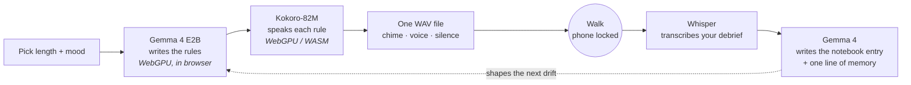

| Step | Open model / library | Runs |
|---|---|---|
| Rules + notebook | [Gemma 4 E2B](https://huggingface.co/litert-community/gemma-4-E2B-it-litert-lm) via [MediaPipe LLM Inference](https://ai.google.dev/edge/mediapipe/solutions/genai/llm_inference/web_js) | WebGPU, in the browser |
| Voice | [Kokoro-82M](https://huggingface.co/onnx-community/Kokoro-82M-v1.0-ONNX) via [`kokoro-js`](https://www.npmjs.com/package/kokoro-js) | WebGPU or WASM |
| Listener | [Whisper base](https://huggingface.co/onnx-community/whisper-base) via [`transformers.js`](https://github.com/huggingface/transformers.js) | WebGPU or WASM |
| Storage | Cache API (models), IndexedDB (notebook) | On the device |
| App | Vite + TypeScript PWA, no framework | Static, on Vercel |

### Engineering notes

- **Why one audio file?** In an installed web app on a locked phone, timers and background GPS get suspended, but audio keeps playing. So Drift prepares the whole walk in advance, as one track with timed silences: no wake-ups, no signal, no GPS.
- **Gemma 4 needs its chat template.** MediaPipe passes the prompt through as-is, and without `<|turn>user … <turn|><|turn>model` markers Gemma 4 returns an empty string. The end-to-end tests caught this.
- **Storage quotas are real.** Gemma 4 E2B is 2 GB, and some browsers allow less than that per site. Drift checks `navigator.storage.estimate()` first. If the model won't fit, it runs it straight from the network and says so, instead of failing silently.
- **Small models can't add up.** Gemma's walk durations rarely sum to the length you asked for, so Drift rescales the silences to match exactly. If the model returns unusable output, a built-in set of rules makes sure the walk still starts.

## Run it locally

```bash
git clone https://github.com/codeswithroh/drift.git
cd drift
npm install
npm run dev
```

Open http://localhost:5173 in a browser with WebGPU (Chrome, Edge, or Safari 26+). On first run, Drift downloads Gemma 4 E2B (about 2 GB) from Hugging Face plus Kokoro and Whisper (about 250 MB), so use Wi-Fi. After that, everything is cached on the device.

**No WebGPU?** Drift falls back to a local [Ollama](https://ollama.com) server:

```bash
ollama pull gemma3n:e2b
```

| Variable | Default | Purpose |
|---|---|---|
| `VITE_GEMMA_MODEL_URL` | Gemma 4 E2B web build on Hugging Face | Self-host the model file |
| `VITE_OLLAMA_URL` | `http://127.0.0.1:11434` | Ollama fallback server |
| `VITE_OLLAMA_MODEL` | `gemma3n:e2b` | Any local Gemma, e.g. `gemma3:4b` |

## Tests

The end-to-end tests drive the real app with **real models** in headless Chromium using [Playwright](https://playwright.dev). Gemma runs via Ollama, Kokoro and Whisper run in the page, and a fake microphone plays recorded speech so Whisper has real audio to transcribe.

```bash
npm run test:e2e
```

| Test | What it proves |
|---|---|
| Full drift | prepare → walk with the screen "locked" → spoken debrief → notebook entry, persisted across reloads; the transcript matches the speech |
| Fallback rules | junk model output still produces a walk |
| End early | ending before playback starts goes to the debrief, not an error |
| No backend | a clear error with a way back |

## Project structure

```
src/
├── llm.ts          Gemma: MediaPipe + Cache API, quota check, Ollama fallback
├── drift.ts        the dérive prompt, validation, rescaling, fallback rules
├── tts.ts          Kokoro → one WAV: chime + voice + silence
├── stt.ts          microphone recording + Whisper
├── screentime.ts   the screen-on counter (Page Visibility API)
├── notebook.ts     debrief → field-notebook entry + memory
├── store.ts        IndexedDB
├── gpu.ts          a real WebGPU check (navigator.gpu existing isn't enough)
├── mascot.ts       Pip: sprite-sheet mascot that follows the pointer and reacts
├── doodles.ts      hand-drawn ink icons
└── main.ts         the screens
e2e/                Playwright tests, screenshot + banner capture
scripts/docs.sh     rebuilds every README / post image from the real app
```

## Roadmap

- [ ] Opus encoding for the walk audio (16 kHz WAV is about 1.9 MB per minute)
- [ ] Share a drift as a link, so friends can walk the same rules
- [ ] Group drifts: a run club gets the same rules at the same time
- [ ] Translate rules and voice into more languages (Kokoro supports several)

## About

Built for the [DEV Hacktoberfest Open-Source AI Challenge, Week 1: Touch Grass](https://dev.to/challenges/hacktoberfest-week1-2026-10-05). Started on October 6, 2026.

## Acknowledgements

- Google's [Gemma](https://ai.google.dev/gemma) team and the [LiteRT community](https://huggingface.co/litert-community) for the web-ready Gemma 4 build
- [hexgrad/Kokoro](https://huggingface.co/hexgrad/Kokoro-82M) and [Xenova](https://github.com/xenova) for `kokoro-js` and `transformers.js`
- OpenAI [Whisper](https://github.com/openai/whisper)
- **Pip** the hedgehog is from [page-mascot](https://github.com/nilbuild/page-mascot) by Kamran Ahmed (MIT), ported to plain TypeScript in `src/mascot.ts`; license in `public/mascot/`
- Guy Debord, *Théorie de la dérive* (1956), for the idea

## License

[MIT](LICENSE)
